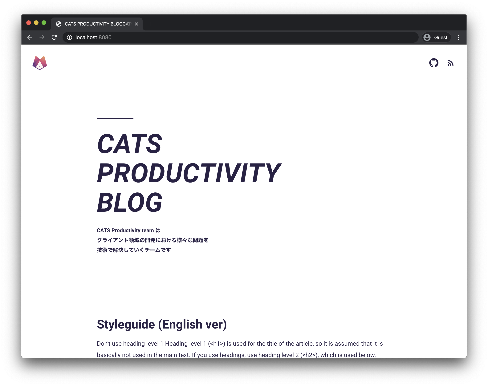

# Hugo CATS Studio



> A simple and minimal Hugo theme.

## Installation

```shell
$ git submodule add https://github.com/cats-oss/hugo-cats-studio.git themes/cats-studio
```

`config.yaml`

```yaml
theme: 'cats-studio'
```

## Setup

### Authors

You should register authors as a taxonomy in your project's `config.yaml`.

```yaml
taxonomies:
  author: authors
```

#### Create authors

Create a filed called `layouts/authors/<name>/_index.md` and fill in the following content.

```markdown
---
name: wadackel
bio: Web Frontend Developer in Japan.
icon: 'https://pbs.twimg.com/profile_images/781853456365592579/JfeS-9ZF_400x400.jpg'
github: 'https://github.com/wadackel'
twitter: 'https://twitter.com/wadackel'
---
```

#### Assign author in your post

Add `authors` field to `content/post/your-post.md`.

```markdown
---
title: Example post
authors: ['wadackel']
---
```

### Example config

```yaml
baseURL: 'https://example.com'
theme: 'hugo-cats-studio'
title: BLOG TITLE
params:
  logo:
    src: /images/logo.png
    alt: Alternative text content
    width: 48
    height: 48
  subtitle: |
    Text content under title 1
    Text content under title 2
    Text content under title 3
  github: https://github.com/cats-oss
googleAnalytics: G-0000000000
hasCJKLanguage: true
paginate: 10
taxonomies:
  author: authors
```

## Development

TODO: Documentation

### Watch assets flies

```shell
$ npm run watch
```

### Development Server

```shell
$ cd exampleSite
$ make watch
```

## License

[MIT License © CyberAgent, Inc.](./LICENSE)
